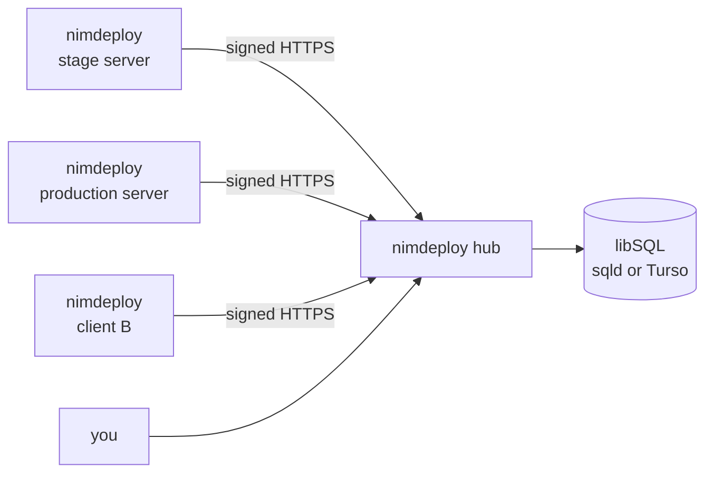

# Central hub

Each nimdeploy runs on its own server. The **hub** gathers them: every
server (an *agent*) sends what happens to it, and the hub shows all clients,
environments and servers in one dashboard, with an API and Prometheus
metrics on top.



- It is the same binary: `nimdeploy hub serve`.
- Agents only make **outgoing** requests: the hub never connects to your
  servers and needs no access to them.
- Each agent has its own token. Requests are signed (HMAC-SHA256 over a
  timestamp and the body) and older than 5 minutes are refused. Revoking one
  agent doesn't touch the others.
- If the hub is down, events wait on the agent's disk (`.hub-outbox` in the
  log directory, up to 5000) and are sent when it's back. Deploys never wait
  for the hub.
- Data lives in [libSQL](https://github.com/tursodatabase/libsql) (SQLite as
  a server): `sqld` next to the hub, or a Turso database.

What agents send:

| Event | When | Contains |
|---|---|---|
| `deploy.started` | a run starts | state: trigger, commit, pusher, labels |
| `deploy.finished` | a run ends | state, duration, error, and on failure the last log lines (`send_log_tail`) |
| `deploy.rejected` | a request was refused (bad signature, wrong repository…) | reason |
| heartbeat | every minute | version, uptime, deploys with their config (provider, repository, branch, schedule, labels) and state, events waiting |

The full log, `params`, the request body and secrets are never sent.

## Run the hub with Docker Compose

```bash
mkdir nimdeploy-hub && cd nimdeploy-hub
curl -fsSLO https://raw.githubusercontent.com/aitorroma/nimdeploy/main/deploy/hub/docker-compose.yml
curl -fsSL https://raw.githubusercontent.com/aitorroma/nimdeploy/main/deploy/hub/.env.example -o .env
sed -i "s/^NIMDEPLOY_HUB_TOKEN=.*/NIMDEPLOY_HUB_TOKEN=$(openssl rand -hex 32)/" .env
docker compose up -d
```

It starts `sqld` (only on an internal network, data in the `sqld-data`
volume) and the hub on `127.0.0.1:9100`. Publish it over HTTPS with your
reverse proxy, e.g. nginx:

```nginx
server {
    server_name hub.example.com;
    # listen 443 ssl; certificates...
    location / {
        proxy_pass http://127.0.0.1:9100;
        proxy_set_header Host $host;
        proxy_set_header X-Forwarded-Proto $scheme;
        proxy_set_header X-Forwarded-For $remote_addr;
    }
}
```

The dashboard asks for the `NIMDEPLOY_HUB_TOKEN`. Behind Cloudflare Access
(or another authenticating proxy) you can let its header in instead:
`NIMDEPLOY_HUB_TRUSTED_HEADER=Cf-Access-Authenticated-User-Email`. Do that
only if the proxy is the only way to reach the hub, since anyone who can
reach it directly could send that header. Leave `/api/v1/events` reachable
by the agents (in Cloudflare Access, a bypass rule for that path; the
agents authenticate with their own signature).

## Run the hub on Kubernetes (Helm)

```bash
helm install hub oci://ghcr.io/aitorroma/charts/nimdeploy-hub -n nimdeploy --create-namespace \
  --set ingress.enabled=true --set ingress.host=hub.example.com \
  --set ingress.className=nginx --set 'ingress.tls[0].secretName=hub-tls' \
  --set 'ingress.tls[0].hosts[0]=hub.example.com'

# dashboard token (generated on install, kept on upgrades)
kubectl -n nimdeploy get secret hub-nimdeploy-hub -o jsonpath='{.data.token}' | base64 -d; echo
```

The chart runs the hub (a Deployment, non-root, read-only filesystem) and
`sqld` (a StatefulSet with a 2 Gi volume, reachable only from the hub through
a NetworkPolicy). Main values:

| Value | Default | |
|---|---|---|
| `hub.token` / `hub.existingSecret` | generated | dashboard and API token (Secret key `token`) |
| `hub.trustedHeader` | – | header from an authenticating proxy |
| `hub.retainDays` | `90` | events older than this are deleted (the current state stays) |
| `sqld.enabled` | `true` | `false` with `externalDatabase.url` (and `token`) for Turso |
| `sqld.persistence.size` | `2Gi` | |
| `ingress.*` | disabled | |
| `serviceMonitor.enabled` | `false` | scrape `/metrics` with the Prometheus Operator |

## Connect a server

On the hub, create the agent. Its token is printed once:

```bash
docker compose exec hub nimdeploy hub agent add squirrel-stage
# Kubernetes: kubectl -n nimdeploy exec deploy/hub-nimdeploy-hub -- nimdeploy hub agent add squirrel-stage
```

On the server, add it to the config, and the token to `secrets.env`:

```toml title="config.toml"
[labels]
client = "Squirrel Media"
environment = "stage"

[hub]
url = "https://hub.example.com"
agent = "squirrel-stage"           # default: the short hostname
token_env = "NIMDEPLOY_HUB_TOKEN"
# send_log_tail = 20               # log lines sent with a failed deploy (0-500)
# heartbeat = "1m"
```

```bash title="secrets.env"
NIMDEPLOY_HUB_TOKEN=…
```

Restart nimdeploy (`systemctl restart nimdeploy`). The server appears in
**Agents** within seconds, with its deploys, even those that never ran. Set
[labels](labels.md) on every server: the dashboard groups by `client` and
`environment`.

An agent that misses three heartbeats shows as **offline**, and its deploys
are faded in the dashboard (their state may be old). A deploy removed from
the config shows as *removed* until its events expire.

## Dashboard

- **Deploys**: counters (failing, running, agents offline), filters by
  client, environment, agent and status, a client × environment matrix with
  every deploy colored by its last result, the list of deploys and the latest
  activity. It refreshes every 30 seconds.
- **Deploy detail**: repository, branch, last commit, labels, the history
  of runs and rejected requests, and the log tail of failed runs.
- **Agents**: online/offline, host, version, last heartbeat, uptime, events
  waiting in its outbox.

## API and metrics

With `Authorization: Bearer <NIMDEPLOY_HUB_TOKEN>`:

| Endpoint | |
|---|---|
| `GET /api/v1/deploys?label=client=Acme&agent=…` | every deploy and its state |
| `GET /api/v1/agents` | agents (without tokens) |
| `GET /api/v1/events?agent=&deploy=&type=&limit=` | events, newest first (up to 1000) |
| `POST /api/v1/agents` `{"name":"…"}` | create an agent or give it a new token; returns it |
| `DELETE /api/v1/agents/{name}` | revoke |
| `GET /metrics` | Prometheus |
| `GET /healthz` | no token; checks the database too |

Creating and revoking agents only accepts the Bearer token, never the
browser session or the proxy header.

| Metric | |
|---|---|
| `nimdeploy_hub_agent_up{agent,version}` | 1 while heartbeats arrive |
| `nimdeploy_hub_agent_last_seen_timestamp_seconds{agent}` | |
| `nimdeploy_hub_agent_outbox_events{agent}` | events waiting on the agent: the hub isn't reachable from there |
| `nimdeploy_hub_deploy_info{agent,deploy,<labels>}` | 1 |
| `nimdeploy_hub_deploy_status{agent,deploy,status}` | 1 for the current status |
| `nimdeploy_hub_deploy_last_finished_timestamp_seconds{agent,deploy}` | |

```yaml title="alerts.yml"
- alert: NimdeployAgentDown
  expr: nimdeploy_hub_agent_up == 0
  for: 10m
- alert: NimdeployProductionDeployFailed
  expr: nimdeploy_hub_deploy_status{status="failed"} == 1
        and on (agent, deploy) nimdeploy_hub_deploy_info{environment="production"}
```

## Command line

```text
nimdeploy hub serve [-listen ADDR] [-database URL] [-trusted-header H] [-retain-days N] [-no-auth]
nimdeploy hub agent add|list|revoke [name]
nimdeploy hub healthcheck
```

| Variable | |
|---|---|
| `NIMDEPLOY_HUB_DATABASE_URL` | `http://sqld:8080`, or `libsql://<db>-<org>.turso.io` |
| `LIBSQL_AUTH_TOKEN` | database token (Turso, or sqld with JWT auth) |
| `NIMDEPLOY_HUB_TOKEN` | dashboard and API token, at least 16 characters |
| `NIMDEPLOY_HUB_LISTEN` | default `127.0.0.1:9100` (`0.0.0.0:9100` in the image) |
| `NIMDEPLOY_HUB_TRUSTED_HEADER` | |
| `NIMDEPLOY_HUB_RETAIN_DAYS` | default `90`; `0` keeps every event |

Without a token or a trusted header, the hub only starts on a loopback
address (or with `-no-auth`).

## Backups

Everything is in sqld's data volume. Stop sqld for a few seconds and copy
it. Meanwhile the agents keep their events in their outbox and send them
afterwards:

```bash
docker compose stop sqld
docker run --rm -v nimdeploy-hub_sqld-data:/data:ro -v "$PWD":/backup alpine \
  tar czf /backup/hub-$(date +%F).tgz -C /data .
docker compose start sqld
```

On Kubernetes, use your volume snapshots (or Velero) for the sqld PVC.

Losing the data isn't serious. With the next heartbeat the agents send their
inventory again. You only lose the event history and the agents' tokens, and
you just create the agents again.
