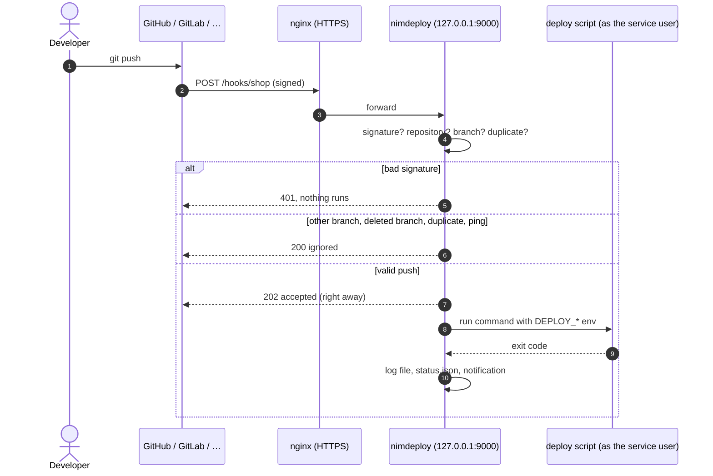

# How it works



## What happens on a push

1. **The git host sends the webhook** to `https://<your domain>/hooks/<app>`.
   Your reverse proxy forwards it to nimdeploy, which only listens locally.
2. **nimdeploy checks it**, in this order:
    - the **signature** (HMAC SHA-256 for GitHub, Gitea, Forgejo and Bitbucket;
      the secret token for GitLab) against that deploy's secret. Wrong or
      missing: `401`, nothing else happens;
    - the **repository** must be the configured one;
    - the **branch** must be the configured one; tag pushes and branch
      deletions are ignored;
    - **duplicates** (same delivery ID, e.g. *Redeliver*) are ignored.
3. **It answers at once** (`202`) so the git host never times out, and runs
   the deploy in the background.
4. **It runs your command** as the user nimdeploy runs as, in its
   `working_directory`, with the push details in the environment. The command
   is run directly (no shell) unless you ask for one.
5. **It records the result**: a log file per run with the full output,
   `latest.log`, `status.json`, an entry in `nimdeploy history`, a line in the
   journal and, if configured, a notification and a commit status.

!!! tip "Not only git pushes"
    With `provider = "generic"` any system can trigger a deploy with a JSON
    body (Ansible, CI, scripts), and declared values are passed to the
    command: see [Generic webhooks and Ansible](guides/generic.md).

## Rules every deploy follows

| | |
|---|---|
| **One at a time** | One run per deploy (`lock = true`). Different deploys run in parallel. |
| **Latest push wins** | A push during a run is queued; later pushes replace the queued one, so after a burst only the newest commit is deployed (`queue = true`). With `queue = false` it gets `409`. For events where each one counts (sales, jobs), `queue_mode = "all"` keeps them all, in order, on disk. |
| **Exact commit** | The script gets the pushed commit in `DEPLOY_COMMIT`, not "whatever the branch has now". |
| **Timeout** | 30 minutes by default. On timeout the whole process group gets `SIGTERM`, then `SIGKILL` 10 s later, so no orphan builds keep running. |
| **No retries** | A failed run is not repeated by itself: fix and push again, or `nimdeploy run`. |
| **Clean environment** | Every secret named in the config is removed from the script's environment. |
| **Reload without interruption** | `systemctl reload nimdeploy` applies `config.toml` changes; running deploys continue. |

## What the script receives

| Variable | Example |
|---|---|
| `DEPLOY_NAME` | `shop` |
| `DEPLOY_TRIGGER` | `webhook`, `manual`, `rollback` or `schedule` |
| `DEPLOY_PROVIDER` | `github` |
| `DEPLOY_REPOSITORY` | `acme/shop` |
| `DEPLOY_BRANCH` | `main` |
| `DEPLOY_REF` | `refs/heads/main` |
| `DEPLOY_COMMIT` | `9f1c2e7…` (empty for `nimdeploy run` without `-commit`) |
| `DEPLOY_PUSHER` | `ana` |
| `DEPLOY_DELIVERY` | the provider's delivery ID |
| `DEPLOY_EVENT`, `DEPLOY_RESOURCE_ID` | non-git events, e.g. `order.updated` and `1234` |
| `DEPLOY_PAYLOAD_FILE` | generic and WooCommerce: the request body, in a `600` file deleted after the run |
| `DEPLOY_OUTPUT` | an empty `600` file for the command's results (for the [email](guides/email.md)), deleted after the run |
| `NIMDEPLOY`, `NIMDEPLOY_CONFIG` | nimdeploy's path and config, for scripts that call it (e.g. `woocommerce note`) |

Plus the deploy's own `env` entries, and its [params](guides/generic.md#params)
(values taken from the webhook's JSON after validation, e.g. `SERVICE=api`). Because `DEPLOY_COMMIT` is empty for a
plain manual run, scripts should fall back to the branch:

```bash
git reset --hard "${DEPLOY_COMMIT:-origin/$DEPLOY_BRANCH}"
```

## Where things live

=== "User install"

    | | |
    |---|---|
    | binary | `~/.local/bin/nimdeploy` |
    | config, secrets | `~/.config/nimdeploy/config.toml`, `secrets.env` |
    | logs | `~/.local/state/nimdeploy/<deploy>/` |
    | service | `systemctl --user … nimdeploy` |

=== "Service account (setup-root.sh)"

    | | |
    |---|---|
    | binary | `~<user>/.local/bin/nimdeploy` |
    | config, secrets | `~<user>/.config/nimdeploy/config.toml`, `secrets.env` |
    | logs | `/var/log/nimdeploy/<deploy>/` |
    | service | `systemctl … nimdeploy` (system unit, `User=<user>`) |

=== "Root install"

    | | |
    |---|---|
    | binary | `/usr/local/bin/nimdeploy` |
    | config, secrets | `/etc/nimdeploy/config.toml`, `secrets.env` |
    | logs | `/var/log/nimdeploy/<deploy>/` |
    | service | `systemctl … nimdeploy` (runs as `deploy` by default) |

## Resource use

nimdeploy itself is a single Go process that idles at a few MB of memory and
no CPU between webhooks. What costs memory is your build (`npm run build`,
`composer install`), which runs as a child process: size the server for that.
